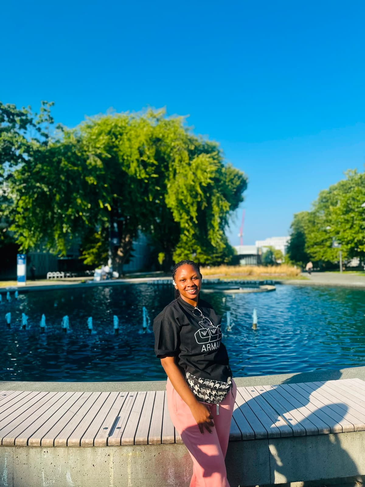

Growing up, one of my biggest dreams was to study at a top university and experience life in Canada. Through hard work, dedication, and the different steps in my academic and professional journey, that dream eventually brought me to Vancouver to pursue the Master of Data Science program at the University of British Columbia. I arrived on August 2, 2026, which gave me some time to enjoy the summer and explore places such as Stanley Park, the Vancouver Art Gallery, Kitsilano Beach, and the UBC campus. I have enjoyed how peaceful Vancouver feels, although I quickly discovered that it can also be quite expensive!

Our MDS orientation began on August 26, and it marked the real beginning of this new chapter. I had already heard that the ten-month program would be intense, but orientation gave me the opportunity to meet my classmates and begin building connections. Although making new friends does not always come easily to me, I enjoy socializing, networking, and helping others, so it was encouraging to meet people at my table and get to know them. Once classes began, I realized that having previous exposure to Python, R, and statistics was helpful, but I would still need a great deal of practice to understand the material deeply and keep up with the pace of the program.

After the first two weeks, I can definitely say that MDS is challenging. There are quizzes to prepare for, labs to complete, concepts to review, and new material arriving constantly. I am learning not only data science, but also how to manage my time, work more efficiently, and ask for support when I need it. I naturally like to take time to analyze problems carefully, so adapting to the speed of the program is something I am actively working on. Some days end with me exhausted and needing a short nap before returning to work, but I keep reminding myself that I worked hard to reach this point and that growth takes persistence. I hope that as the program continues, I will become more comfortable with the pace while continuing to learn, improve, and enjoy this opportunity.